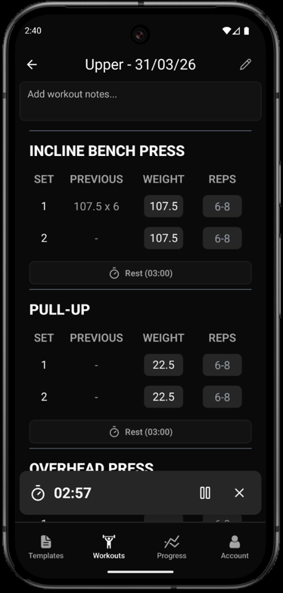
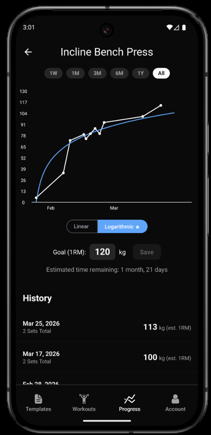

# Lifting Log 

Lifting Log is a full stack Android weightlifting tracker built as my final year project at Queen Mary University of London. This application acts as an "Invisible Coach", using historical workout data to automate progressive overload and forecast future strength gains.

For an in depth look at the entire development cycle read my full [Undergraduate Project Report](./readme-files/Mohammed_Hamza_Huda_UG_Project_Report.pdf).

<table>
  <tr>
    <td>
      
    </td>
    <td>
      
    </td>
  </tr>
</table>

## Tech Stack
This project is split between a React Native frontend and a Django REST Framework backend.

### Mobile Client (Frontend)
- React Native (Using Expo and Expo Router)
- TypeScript
- Tailwind CSS via NativeWind, React Native Reusables
- SQLite (for instant exercise searching)
### REST API + DB (Backend)
- Django with Django Rest Framework
- Python
- MySQL (manipulated via Django ORM)
- Docker + Docker Compose (for DRF server and MySQL db)
- Supabase Auth via JWTs ([my custom authentication](./backend/tracker/authentication.py).)
