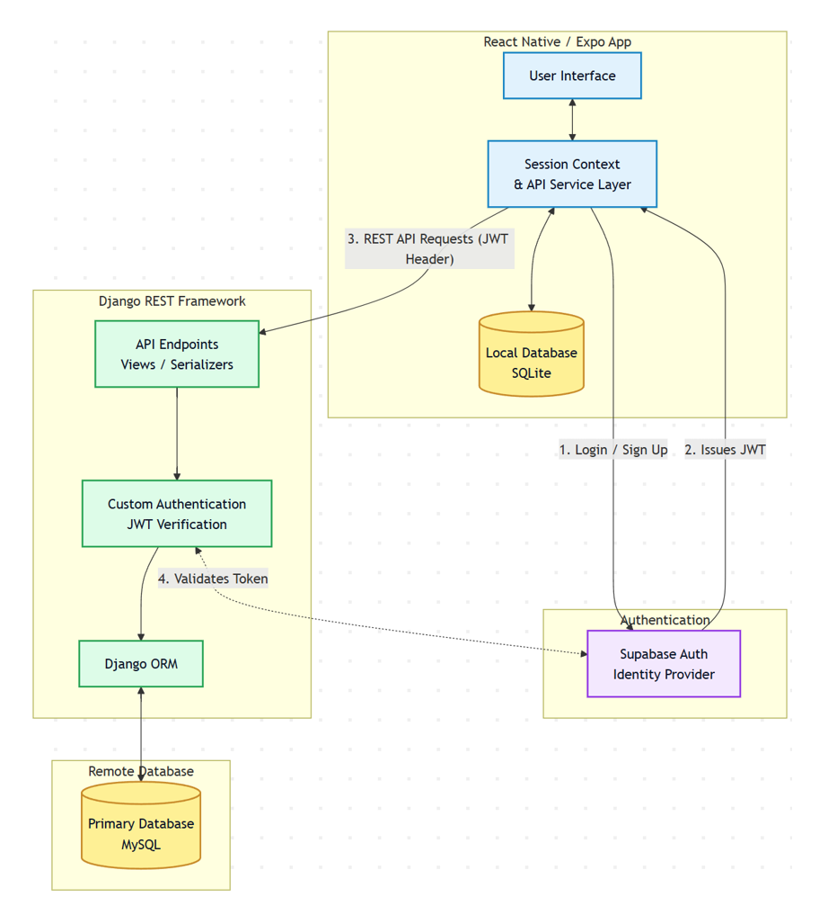

# Lifting Log

An Android weightlifting tracker designed to act as "Invisible Coach", automatically incrementing your lifts and estimating strength gain timelines so you can focus purely on the lift.

For an in depth look at the code and development cycle read the full [Undergraduate Project Report](./readme-files/Mohammed_Hamza_Huda_UG_Project_Report.pdf).

<table>
  <tr>
    <td>
      
    </td>
    <td>
      
    </td>
  </tr>
</table>

## Overview

Although the market is saturated with weightlifting tracking applications, many lack key features that genuinely improve the user experience for the average lifter. They are often bloated with unnecessary social features and place computationally inexpensive analytics behind paywalls.

Lifting Log solves this by removing the clutter and giving you free access to all your data, it uses your data to implement automatic progressive overload and forecasts estimated strength gain timelines (using linear and logarithmic regression models) based on past performance.

## Tech Stack

React Native, Expo, TypeScript, Tailwind CSS (NativeWind), Django REST Framework, Python, MySQL, SQLite, Supabase Auth, Docker

## System Architecture

The entire Lifting Log system is composed of four pillars:

- **Mobile Client (Frontend):** A React Native / Expo application providing the user interface, styled with NativeWind, and containing a local SQLite database for instant custom exercise search queries.
- **Server (Backend):** A Django REST Framework (DRF) Python backend providing API endpoints, custom business logic, serialization, and [JWT verification](./backend/tracker/authentication.py).
- **Authentication:** Externalized to Supabase, providing secure Google OAuth and JWT generation.
- **Database:** MySQL database managed through the Django ORM.

(DRF server and MySQL DB containerised via docker + docker compose)

## Core Algorithms & "Invisible Coach" Features

### 1RM Normalization

To accurately analyze sets and reps, the app normalizes data to a One-Repetition Maximum (1RM) using the Brzycki formula, chosen for its conservative bias.
`1RM = W * 36 / (37 - r)` _(where W = weight, r = reps)_

### Strength Prediction Modeling

The app extrapolates future progress by fitting the user's historical 1RM trend against two mathematical models. The model with the higher coefficient of determination (R²) is selected:

- **Linear Model (y = a + bx):** Represents a constant rate of progression (common in novice lifters). Predictions are capped at 30 days to prevent biologically impossible strength forecasts.
- **Logarithmic Model (y = a + b \* ln(x)):** Represents a curve with a decreasing rate of growth, accurately modeling the tapering effect seen in experienced lifters for longer-term goal setting.

### Automatic Progressive Overload

Implemented via "Double Progression". Users work within a specific rep range (e.g., 6-8 reps) for multiple sets with a static weight. Once the upper bound (8 reps) is successfully hit across all sets, the backend automatically increments the prescribed weight for the next session based on a user-defined step.

## Backend Implementation Highlights

- **JWT Verification:** Created a custom authentication class subclassing DRF's `BaseAuthentication` to verify Supabase-issued JWTs against their JWKS endpoint.
- **Custom Object-Level Permissions:** Implemented `IsObjectOwner` to strictly gatekeep operations, ensuring users can only read/mutate their own workout data.
- **QuerySet Filtering:** Privacy is enforced at the database level by overriding `get_queryset` to filter by the authenticated request user.
- **Nested Serializers:** Utilized nested serializers to fetch a workout and all its associated exercises and sets in a single, cohesive JSON payload, minimizing API calls.
- **Automated Testing:** Comprehensive unit and integration tests written using DRF's `APITestCase` (built on `unittest`) to verify everything from progressive overload logic to API responses.

## Frontend Implementation Highlights

- **Local Data Sync:** An SQLite database holds the exercise dictionary, syncing with the backend on initialization to enable instant, as-you-type search filtering via SQL `MATCH` queries.
- **API Service Layer:** Centralized Axios configuration with request interceptors to automatically attach refreshed JWTs to outgoing requests.
- **File-Based Routing:** Utilized Expo Router for dynamic, nested routing.
- **Auth State Management:** React Context provides global authentication state, preventing access to protected routes.
